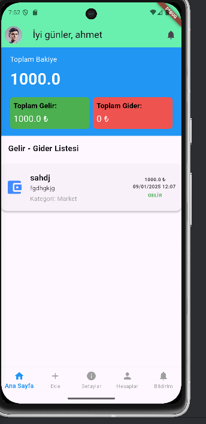
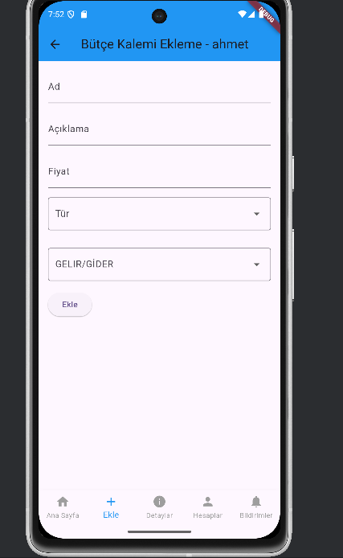
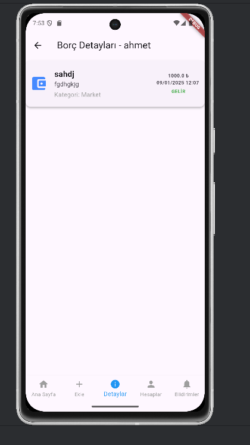
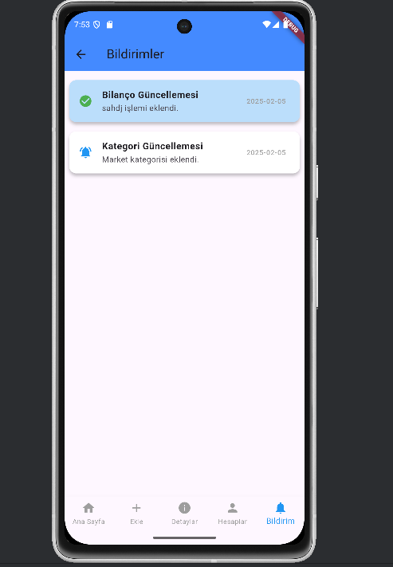

# **Budget Management**  

This **budget tracking app**, developed with **Flutter**, helps you efficiently manage your finances by tracking your **income and expenses**.  

## **Features**  
✅ **Expense Categorization** – Organize your spending into categories (e.g., food, bills, entertainment).  
✅ **Income & Expense Tracking** – Keep a detailed record of your financial transactions.  
✅ **Data Visualization** – View graphical representations of your budget trends.  
✅ **Cross-Platform Support** – Runs on both **Android and iOS**.  
✅ **Secure Data Storage** – Stores financial data locally for privacy and security.  

## **Technologies Used**  
- **Flutter** for cross-platform development  
- **Dart** as the programming language  
- **Local database** for secure storage  

## **Installation**  
1. Clone the repository:  
   
   git clone https://github.com/AhmetFarukTUNC/BudgetManagement/
    
2. Navigate to the project folder:  
   
   like "cd BudgetManagement"
     
3. Install dependencies:  
   
   flutter pub get
     
5. Run the app:  
   
   flutter run
     

## **Screenshots**

## **HOMEPAGE**

This screenshot showcases the homepage of a financial tracking mobile application. The interface displays a greeting message, "Good day, Ahmet," along with the user's total balance, income, and expenses. The income and expense summary is visually distinguished with blue, green, and red cards. Below, a transaction list presents individual records, including transaction name, amount, date, category, and type (income/expense). The bottom navigation bar contains icons for Home, Add, Details, Accounts, and Notifications. The design is clean and user-friendly.

## **ADD DEBT**
 
This screenshot represents a financial tracking mobile app, which includes a form for adding debts. The form consists of fields for **Name, Description, Amount, and Type Selection (Income/Expense)**. The user can select whether the entry is income or an expense from a dropdown list. Upon clicking the **Add** button, the selected transaction type is saved accordingly. The app provides a user-friendly interface for managing financial records efficiently.

## **DEBTS SCREEN**
 
This page allows you to easily view your income and expenses, helping you track your financial situation. By examining your income and expenditures in detail, you can manage your budget more effectively. With this page, you can organize and display all your financial data in a clear and understandable format.

## **NOTİFİCATİONS SCREEN**
 
This page allows you to receive notifications whenever a category or income/expense is added. You can stay updated with instant notifications about every change, ensuring that you can track your finances more effectively. With notifications, you won't miss important updates and can easily access the most current information.

## **License**  
This project is licensed under the MIT License.

